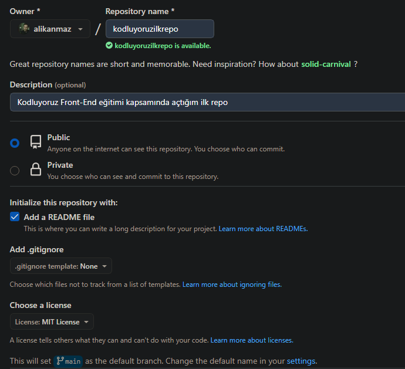

# Kodluyoruz Ilk Repo

Bu repo [Kodluyoruz](https://www.kodluyoruz.org) Front-End Eğitiminde oluşturduğumuz ilk repo. İçerisinde bir adet README dosyası, bir adet de index.html barındırıyor.



## Installation

Öncelikle projeyi clonelayın. (https://github.com/alikanmaz/kodluyoruzilkrepo.git)

```bash
git clone https://github.com/alikanmaz/kodluyoruzilkrepo.git
```


## License
[MIT](https://choosealicense.com/licenses/mit/)

**Author: Ali Kanmaz**
